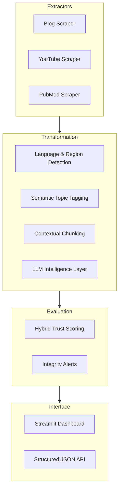

# 🛡️ AI Trust Pipeline: Multi-Source Intelligence & Credibility Scoring

A high-performance, asynchronous pipeline designed to scrape, process, and evaluate the credibility of information from diverse digital sources—specifically **Blogs, YouTube, and PubMed**. The system utilizes a hybrid approach: heuristic weights for metadata and a deep **LLM-powered Fact-Checking layer** for semantic integrity analysis.

---

## 🏛️ System Architecture

The pipeline follows a modular **Extraction → Transformation → Evaluation (ETE) flow**, optimized for speed and resilience.



---

## 🚀 Key Features & Optimizations

*   **⚡ Singleton Model Caching**: Heavy resources like **KeyBERT** and the **Instructor LLM Client** are implemented as singletons. This reduces memory pressure and enables near-instantaneous subsequent analysis by avoiding redundant model reloads.
*   **🎬 Robust Transcript Extraction**: An advanced YouTube scraping engine that handles multiple transcript formats (Manual English → Auto-generated → Multi-lingual fallback) with automated noise cleaning (removing bracketed descriptions, normalizing whitespace).
*   **🧬 Hybrid Scoring Engine**:
    *   **Heuristic Layer**: Evaluates Author Credibility, Domain Authority, Citation Density (age-adjusted), and Recency.
    *   **LLM Fact-Check Layer**: Detects logical fallacies, extreme bias, unverified medical claims, and evidence quality using GPT-4o-mini structured via **Instructor**.
*   **🔬 PubMed Deep Integration**: Direct NCBI Entrez API integration to pull MeSH terms, institutional affiliations, Conflict of Interest (COI) statements, and age-normalized citation rates.
*   **🎨 Premium Dashboard**: A real-time Streamlit interface featuring Plotly-driven reliability charts, radar-chart intelligence breakdowns, and deep-dive JSON inspects.

---

## 🛠️ Technology Stack

| Category | Tools |
| :--- | :--- |
| **Core** | Python 3.10+, Requests, BeautifulSoup4 |
| **Web Scraping** | `newspaper3k`, `yt-dlp`, `youtube-transcript-api`, `Biopython` |
| **Intelligence** | `KeyBERT` (Semantic Tagging), `langdetect`, `Instructor` |
| **LLMs** | OpenAI / OpenRouter (GPT-4o-mini) |
| **Frontend** | `Streamlit`, `Plotly`, `Pandas` |

---

## 📁 Project Structure

```text
Trust/
├── scraper/
│   ├── blog_scraper.py        # Optimized Blog extractor (Heuristic + LLM fallback)
│   ├── youtube_scraper.py     # Robust YT engine (Metadata + Cleaned Transcripts)
│   └── pubmed_scraper.py      # Entrez API wrapper (MeSH, COI, Affiliations)
├── scoring/
│   └── trust_score.py         # The "Brain" - Hybrid weighted algorithm + LLM check
├── utils/
│   ├── tagging.py             # Singleton KeyBERT semantic tagging
│   ├── chunking.py            # Sentence-aware content partitioning
│   ├── language_detect.py     # Geographic & linguistic mapping
│   └── llm_client.py          # Singleton Instructor/OpenRouter config
├── output/                    # Time-stamped JSON intelligence repository
├── main.py                    # Orchestration Layer (CLI entry)
├── app.py                     # Premium Streamlit Interface
└── config.py                  # Dynamic weights, domain authority, & source lists
```

---

## 🚦 How to Run

### 1. Prerequisites
- **Python 3.10+** (Recommended for performance and typing support)
- An **OpenRouter API Key** (Set in `.env`)

### 2. Installation
```bash
# Clone and enter
git clone <repo-url>
cd Trust

# Setup Environment
python -m venv venv
source venv/bin/activate  # venv\Scripts\activate on Windows
pip install -r requirements.txt

# Configure Credentials
# Create a .env file and add your key:
# OPENROUTER_API_KEY=your_openrouter_api_key_here
```

### 3. Execution
**Run Full Pipeline (CLI):**
```bash
python main.py
```
*Results will be saved to `output/scraped_data.json`.*

**Launch Dashboard (Web):**
```bash
streamlit run app.py
```

---

## 🧮 Enhanced Trust Algorithm

The Final Trust Score is calculated through a weighted sum of heuristic factors, then adjusted by a **Penalty Vector** derived from LLM analysis.

### Standard Weighted Factors
| Weight | Factor | Mechanism |
| :--- | :--- | :--- |
| **25%** | Author Credibility | Matches against known experts and institutional affiliations. |
| **20%** | Citation Density | **Age-Adjusted**: Citations / Years since publication. |
| **25%** | Domain Authority | Tiered ranking (High/Medium/Low) based on scientific reputation. |
| **15%** | Recency | exponential decay: < 6 months = 1.0; > 3 years = 0.2. |
| **15%** | Disclosure | Penalizes medical advice without standard disclaimers. |

### Semantic Penalty Layer (LLM)
- **Logical Fallacies**: -15%
- **Unverified Medical Claims**: -25%
- **Extreme Bias/Propaganda**: up to -20%
- **Conflict of Interest (COI)**: up to -5% if financial staking is detected.

---

## ⚠️ Known Limitations
- **Rate Limits**: YouTube and PubMed both enforce rate limits; heavy usage requires API rotation or delay management.
- **Dynamic Content**: Some blog platforms using complex SPAs may require a headless browser (Playwright) which is currently a fallback consideration.
- **LLM Latency**: Deep fact-checking adds ~1-2 seconds per source depending on model selection.

---

## 📄 License
This project is built for professional diagnostic and intelligence gathering purposes.
